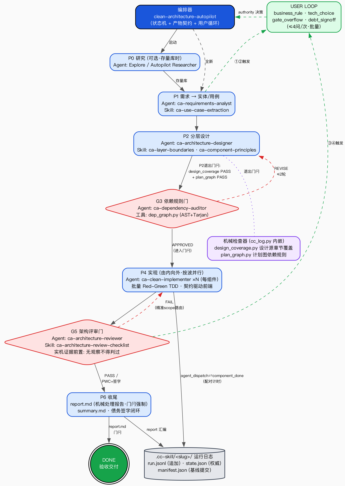

# Clean Architecture Skill & Agent System

**System version: 1.13.1** ｜ 所有 skill 与 agent 版本统一为 `1.13.1`（skill 记于 `SKILL.md` 正文首行注释，agent 记于 frontmatter `version` 字段）

一套基于 Robert C. Martin《Clean Architecture（架构整洁之道）》理论构建的、**语言无关**的多 Agent 开发流水线。它把书里的核心方法论——依赖规则、SOLID、组件内聚/耦合、分层与边界——拆成 **8 个 Skill（1 总控编排器 + 6 方法论 + 1 流程调优）** 和 **5 个职责单一的 Agent**，再用一条带质量门的流水线把它们串起来：**需求 → 分层设计 → 依赖规则审计 → 整洁实现 → 架构评审**。

> 本目录中的所有文件都是**定义 + 文档**，同时提供安装脚本：`bash install.sh` 一键把 8 个 Skill 与 5 个 Agent 部署到本机 agent 运行环境（详见「方式 C」），`bash uninstall.sh` 一键移除。

---

## 1. 为什么是这套结构

《Clean Architecture》的主张可以浓缩成一句话：**让业务规则独立于框架、数据库、UI 和任何外部细节**。实现这一点靠的是一条铁律——**依赖规则（The Dependency Rule）：源码依赖只能指向内层**。

这套体系把这条铁律"编排"进了工作流：靠前的 Agent 负责"提炼纯业务模型 → 设计分层"，中间用一个**廉价但关键的门**在写代码之前就挡住依赖方向错误，靠后的 Agent 负责"由内向外实现 → 全量架构评审"。这样最贵的架构缺陷在纸面阶段就被拦下，而不是等代码写完才发现。

---

## 2. 目录结构

```
clean-code/
├── README.md                                  ← 你在这里
├── install.sh                                 一键安装（skills + agents → 本机）
├── uninstall.sh                               一键反安装（只清本项目的文件）
├── skills/                                     方法论（Agent 调用的知识）
│   ├── clean-architecture-autopilot/SKILL.md   ★ 总控编排器：状态机+dispatch+质量门+增强映射
│   ├── ca-use-case-extraction/SKILL.md            从需求提炼 实体 / 用例
│   ├── ca-layer-boundaries/SKILL.md               四层定义、边界 DTO、边界粒度、尖叫架构
│   ├── ca-dependency-rule/SKILL.md                依赖规则 + DIP 跨界 + Humble Object
│   ├── ca-solid-principles/SKILL.md               SRP/OCP/LSP/ISP/DIP（类级）
│   ├── ca-component-principles/SKILL.md           REP/CCP/CRP + ADP/SDP/SAP（组件级）
│   ├── ca-architecture-review-checklist/SKILL.md  质量门评审清单 + 严重度校准
│   └── ca-process-tuning/SKILL.md                 流程复盘调优：项目目录(+日志)→调优报告
├── agents/                                     角色（谁在什么阶段做什么）
│   ├── ca-requirements-analyst.md                 阶段1：需求 → 实体/用例
│   ├── ca-architecture-designer.md                阶段2：分层、端口、组件图、目录
│   ├── ca-dependency-auditor.md                   阶段3：依赖规则 + 无环 门（GATE）
│   ├── ca-clean-implementer.md                    阶段4：由内向外实现，自校验
│   └── ca-architecture-reviewer.md                阶段5：全量评审 门（GATE）
└── pipeline/
    ├── orchestration.md                        DAG 流程、质量门、反馈回路、并行策略
    ├── flow.mermaid                            处理流程图源（每环节的 Agent/Skill/增强）
    ├── flow.png                                流程图 PNG（mermaid 渲染）
    ├── autopilot-flow.dot                      结构化流程图正典源（Graphviz，证据可溯源）
    ├── autopilot-flow.drawio                   可编辑 Draw.io 交付版（稳定 ID 同源）
    └── autopilot-flow.png                      高清流程图 PNG（@200DPI，README 内嵌）
```

**三层心智模型**：`skills/` 是"知识"，`agents/` 是"用知识的人"，`pipeline/` 是"怎么把人排成流水线"。一个 Skill 可被多个 Agent 复用（例如 `ca-dependency-rule` 同时服务审计员和实现者）。

**命名约定（v1.9.0 起）**：7 个方法论 skill 统一带 `ca-` 前缀（`ca-dependency-rule`、`ca-process-tuning`…），5 个 agent 同样带 `ca-` 前缀（`ca-requirements-analyst`、`ca-architecture-reviewer`…）——skill 目录装进的是**平铺共享命名空间**（`~/.agents/skills/`），agent 名会进入共享的 agent 派发清单，通用名（如 `solid-principles`、`clean-implementer`）容易与第三方包撞名互相遮蔽；总控编排器 `clean-architecture-autopilot` 不加前缀，它就是包名锚点（agents 的安装子目录与之同名）。

---

## 3. 五个 Agent 与它们的映射

| 阶段 | Agent | 职责 | 调用的 Skill | 对应书中章节 |
|---|---|---|---|---|
| 1 | 需求分析师 | 把需求拆成**实体（企业规则）**与**用例（应用规则）**，推迟一切技术选型 | ca-use-case-extraction | Business Rules |
| 2 | 架构设计师 | 分层归位、定义端口与边界 DTO、选边界粒度、画组件图、给出**尖叫式目录** | ca-layer-boundaries · ca-component-principles · ca-solid-principles | Boundaries / Screaming Architecture |
| 3 | 依赖规则审计员（门） | 写码前证明**依赖全部朝内 + 组件图无环**，否则打回 | ca-dependency-rule · ca-component-principles | The Dependency Rule / Component Coupling |
| 4 | 整洁实现者 | 由内向外实现：实体→用例→适配器→框架，只在 `main` 装配具体实现 | ca-dependency-rule · ca-solid-principles · ca-layer-boundaries | Humble Object / Main Component |
| 5 | 架构评审员（门） | 用完整清单打分，出 PASS / PASS_WITH_CONCERNS / FAIL | ca-architecture-review-checklist（+ 三个深入 skill） | 全书作为验收标准 |

---

## 3.5 总控入口：clean-architecture-autopilot

### 流程总览



> 图源为 Graphviz DOT（`pipeline/autopilot-flow.dot`，**正典**，每个元素可溯源到 `SKILL.md` 与 `cc_log.py` 门闩常量）；另有可编辑的 Draw.io 交付版 `pipeline/autopilot-flow.drawio`（稳定 ID 与 DOT 一致）。图中：蓝=阶段、红菱形=质量门（含 ≤2 轮返工回路）、紫虚线=机械检查器（P2 退出门闩）、灰圆柱=运行日志账本、绿虚线=USER LOOP 四触发器。流程变化时**先改 DOT 再同步**。

之前这套体系缺一个"装配线"——`orchestration.md` 只是图纸，串接靠人工。现在补上了
`skills/clean-architecture-autopilot/SKILL.md` 作为**唯一编排入口**，它把上面 5 个 Agent
真正跑起来：

- **状态机**：`INIT → P0研究? → P1需求 → P2设计 → G3依赖门 → P4实现 → G5评审门 → P6收尾`，
  每个 phase 有进入/退出条件，靠 artifact 契约校验才放行。
- **dispatch 表**：每一步派哪个 Agent、注入哪个方法论 Skill、传什么 artifact JSON。
- **质量门路由**：G3 出 `APPROVED`/`REVISE_REQUIRED`（回 P2，≤2 轮）；G5 出
  `PASS`/`PASS_WITH_CONCERNS`(记债)/`FAIL`（按 BLOCKER 类型回退 P4 或 P2）。
- **用户回路**：需求歧义、技术选型、门超迭代上限、MAJOR 转技术债 这四种情况暂停问你。前两类是
  **信息缺口**——答案可能已经在 P0 调研笔记、设计源或 P2 产物里，必须先去查并记录查了什么，查到的
  算「自行采纳」而不是提问；后两类是**授权决策**，只有你能拍。提问一律**批量**：一个 phase 边界一次
  暂停、最多 4 个问题（一次交互问完），而不是一个决策打断一次——除非后一个问题的选项取决于前一个的
  答复。技术债签字必须重复本轮待签债务、引用本轮提问的事件序号并记录你的答复；脚本能证明顺序和签的
  是哪些债，不能鉴别人类身份，所以 agent 仍被明确禁止伪造答复。
- **运行日志与审计轨迹**：所有日志统一放在项目根的 `.cc-skill/` 下，每个任务一个
  以**任务简述命名**的子目录（如 `.cc-skill/place-order/`）。其中追加式写
  `run.jsonl`（逐事件：进/出 phase、派了哪个 Agent、注入哪些 Skill、门的 verdict、
  回退计数、用户暂停、依赖规则覆盖冲突），落盘每个 phase 的 artifact 快照，结束时生成
  `summary.md`（含各门循环轮数、实际用到/跳过的 superpowers、技术债、每阶段耗时和"下次
  可调优点"）。日志只追加不覆盖、且屏蔽密钥；同名任务再跑时子目录追加时间戳后缀避免覆盖。
  用于后续**核对**（回放全过程）与**调优**（跨 `.cc-skill/` 各任务子目录发现反复循环的门、
  无用的增强、耗时瓶颈）。
- **日志是机械命令，不靠模型自觉**：`.cc-skill/` 的创建与写入由随附脚本
  `skills/clean-architecture-autopilot/scripts/cc_log.py` 落实。skill 的 **Step 0 Bootstrap**
  强制第一步就 `cc_log.py init` 建目录，之后每次 phase 进出/门判都调 `cc_log.py event`（一次调用同时
  覆写 `state.json` + 追加 `run.jsonl`）。强约束：`phase_enter` 未记录不得进入该 phase、`gate_verdict`
  未记录不得过门；到 P1 时若 `.cc-skill/<slug>/` 不存在必须先补 `init`；`user_loop` 必须声明 trigger、
  用文字写清问了什么、单次不超过 4 个问题，信息缺口类还要给出查过哪些来源；`debt_signoff` 必须重复
  本轮 PWC 的债务清单、引用本轮提问的事件序号并带你的答复（否则那道「P6 不得带未签字技术债进入」的
  门只是在验证「有人写过一条签字记录」，而这条记录 agent 自己就能写）。这样避免"规范只是 prose、模型
  跑起来却没生成 `.cc-skill/`"的问题。

用法：把 `clean-architecture-autopilot/SKILL.md` 作为系统提示喂给你的编码 Agent，附上需求，
它会按状态机自行推进并在该问你的时候停下来。

- **进度检查点与断点续跑（抗上下文压缩）**：除追加式 `run.jsonl` 外，每次 phase/门转移都会**原地覆写**
  一个 `state.json`，一眼给出"当前在哪个 phase、状态、各门 verdict、循环轮数、该重载哪些 artifact、
  有无待答问题、下一步动作"。每轮开始先读它：即使模型上下文被压缩、内存细节丢了，也能从 `state.json`
  + `artifact_pointers` 精确续跑，而不是重新规划或重复提问；`state.json` 与 `run.jsonl` 尾部不一致
  时以追加日志为准并重建。

---

## 3.6 用 Superpowers 增强每个环节

每个环节除了本地方法论 Skill，还可叠加运行环境里的 **superpowers** skill / agent 提高严谨度。
**增强是叠加式的**：只加严谨度，绝不覆盖依赖规则或本地方法论；若某个 superpowers 建议让依赖朝外
或在 `main` 之外装配具体实现，一律以依赖规则为准并记录冲突。

| 环节 | 本地 Skill | 增强 Superpowers Skill | 增强 Agent |
|---|---|---|---|
| P0 研究(可选) | — | find-skills, context7 | Explore, Autopilot Researcher |
| P1 需求 | ca-use-case-extraction | **brainstorming**(必做), feature-spec | general-purpose |
| P2 设计 | ca-layer-boundaries 等 | writing-plans, plan-eng-review | Plan, Autopilot Designer/Planner |
| G3 依赖门 | ca-dependency-rule | **ast-code-analysis-superpower**(ast-grep 机扫违规/环) | Explore |
| P4 实现 | ca-dependency-rule 等 | test-driven-development, executing-plans, dispatching-parallel-agents, using-git-worktrees, systematic-debugging/investigate, verification-before-completion | Autopilot Implementer |
| G5 评审门 | ca-architecture-review-checklist | requesting-code-review, ast-code-analysis-superpower, codex(对抗), review | Autopilot Code Reviewer |
| P6 收尾 | — | receiving-code-review, finishing-a-development-branch, ship | — |

几个关键增益点：P1 的 `brainstorming` 确保不先入为主建错模型；G3 用 `ast-code-analysis-superpower`
把"依赖朝内"从肉眼审查变成可复现的 ast-grep 机扫；P4 靠 `test-driven-development` 先写实体/用例
测试（无需 DB/UI 即可跑，反证内层已隔离）+ `dispatching-parallel-agents` 按组件并行（G3 已证无环所以
安全）；G5 用 `codex` 做对抗式"找茬"。每个 Agent 文件末尾的 "Superpowers Augmentation" 区块有细则。

---

## 3.7 流程复盘调优：ca-process-tuning

`skills/ca-process-tuning/SKILL.md` 回答的是和架构评审**不同**的问题——评审问"产出的代码好不好"，
调优问"这条流程本身跑得好不好、下次该改哪里"。它把 `.cc-skill/` 日志设计的价值闭环起来。

- **输入**：做完的项目目录（必给）+ 该任务的 `.cc-skill/<任务简述>/` 日志（可选但强烈推荐）。
- **两类证据各能证明什么**：只给项目目录 → 只能做**逆向架构审计**（重建依赖图、查朝外依赖/环/
  I·A·D 离群），代码里的违规**间接**反推某道门判松了；日志才能揭示返工循环、门循环轮数、用户为何被
  打断、哪些增强真触发、各 phase 耗时——这些代码里看不到，因为代码只留终态不留过程。
- **降级模式**：若项目当初不是用本编排器跑的、没有 `.cc-skill/`，回退到 **git 历史 + 代码结构**做
  弱推断（从 commit 返工/回滚模式猜热点），并把这类结论标 `low-confidence`。
- **输出**：一份调优报告——各门有效性（well_calibrated / too_loose / too_strict + 修法）、返工
  热点排名、superpowers ROI（keep/drop/promote）、各阶段耗时建议、**提问纪律**（问了几个 vs 自行
  从产物解决几个、有没有「信息缺口类提问但没查过任何来源」、有没有「签字前根本没问」）、以及排好序的
  **top 3 调优动作**（每条都附证据）。报告写回 `.cc-skill/` 便于跨任务累积。
- **一条纪律**：门反复循环通常是**上游**边界/actor 有歧义，应调上游 phase，而不是"直接把门放松"。

用法：把做完的项目目录（连同 `.cc-skill/` 日志一起最好）丢给我并说"看看流程要不要调优"，我就按这个
清单产出报告。

---

## 4. 如何使用

### 方式 A：作为人工检查清单 / 团队规范
直接把 `skills/*/SKILL.md` 当作评审手册。做设计评审时按 `ca-architecture-review-checklist` 逐条打分；做模块拆分时用 `ca-component-principles` 算 `I / A / D`；判断某个类放哪层时用 `ca-dependency-rule` 的"放置决策流程"。

### 方式 B：驱动你的 AI 编码 Agent（推荐）
按流水线阶段，逐段把对应的 Agent 定义 + Skill 内容喂给你的编码助手：

1. **阶段 1**：贴上 `agents/ca-requirements-analyst.md` + `skills/ca-use-case-extraction/SKILL.md`，附上你的需求 / PRD / 用户故事。产出实体、用例、被推迟的技术细节、待澄清问题。
2. **阶段 2**：把上一步的产出连同 `agents/ca-architecture-designer.md` + 三个设计类 skill 一起喂入。产出分层图、端口、边界 DTO、组件图、目录树、设计说明。
3. **阶段 3（门）**：用 `agents/ca-dependency-auditor.md` 审计设计。若 `REVISE_REQUIRED`，带着精确的违规点回到阶段 2（最多 2 轮，仍不过就把歧义抛给你决策）。
4. **阶段 4**：`APPROVED` 后，用 `agents/ca-clean-implementer.md` **由内向外**逐层实现，每层做导入方向自校验 + 单元测试。组件图无环，所以独立组件可并行实现。
5. **阶段 5（门）**：用 `agents/ca-architecture-reviewer.md` 跑完整清单。BLOCKER 必须清零；MAJOR 只能在你签字后作为技术债接受。

### 方式 C：一键安装到本机 Skill 运行环境（Qoder / qoderwork 用户推荐）
在仓库根目录执行：

```bash
bash install.sh      # 安装 / 更新到最新
bash uninstall.sh    # 反安装（只移除本项目的文件，不动其他 skill/agent）
```

安装布局：

| 内容 | 位置 | 形式 |
|---|---|---|
| 8 个 Skill | `~/.agents/skills/<name>` | 真实拷贝（唯一事实源，Qoder 读这里） |
| 8 个 Skill | `~/.qoderwork/skills/<name>` | 软链 → `~/.agents/skills/<name>`（qoderwork 读这里） |
| 5 个 Agent | `~/.qoder/agents/clean-architecture-autopilot/` | 真实拷贝（包式子目录） |
| 5 个 Agent | `~/.qoderwork/agents/clean-architecture-autopilot/` | 真实拷贝（包式子目录） |

**Skill 不装 `~/.qoder/skills`**：Qoder 同时读 `~/.qoder/skills` 与 `~/.agents/skills`，两处都装会让 skill 列表重复；旧版脚本装到那里的残留会被 install.sh 顺带清除（应用侧迁移已把它们改名留在 `~/.qoder/skills-bk`，脚本不动那个备份）。**Agent 不平铺在 agents 根目录**：统一放按项目命名的子目录 `clean-architecture-autopilot/`（Qoder 2026-09 起的包式布局，平铺 .md 会被应用搬进子目录；qoderwork 侧同样采用），旧平铺残留由 install.sh 清除。

`install.sh` 自带三道预检：每个 skill 必有 `SKILL.md`、总控的 4 个机械脚本（`cc_log.py` 等）必须在场、**全仓版本号必须一致**（skill 首行注释与 agent frontmatter 对齐，不一致拒绝安装——防止把漂移版本部署出去）。同步用 `rsync --delete`，仓库里删掉的文件安装时也会删掉，`__pycache__`/`.DS_Store` 不安装；重复执行幂等。**仓库每次更新后重跑一次 `bash install.sh`** 即可保持各位置一致（历史上 run4 就因安装副本停在 v1.3.0 而踩坑）。

若要迁移到其它 agent 运行环境：把 `skills/` 下每个目录（含 `SKILL.md`）拷到你的 agent skill 目录，把 `agents/` 映射为子 agent 定义，再按 `pipeline/orchestration.md` 的 DAG 编排即可。当前所有 SKILL.md 的 frontmatter 严格只含 `name` / `description` 两个字段（符合 Anthropic Skill 编写规范），版本号以注释形式记在正文首行而不占 frontmatter；每个 `description` 均含正向触发词与负向排除（`Not for …`），用于拉开相邻 skill 之间的触发边界。

---

## 5. 一次完整走查（微型示例）

需求：*"客户可以下单，订单不能为空，下单后要持久化并返回订单号与总价。"*

- **阶段 1** →
  实体 `Order`（不变量：不能确认空订单；`total()>=0`）；用例 `PlaceOrder`（request `{customerId, items[]}`，response `{orderId, total, status}`，端口 `OrderRepository`/`ProductCatalog`）；推迟细节：`"持久化" → OrderRepository 端口`（没选数据库）。
- **阶段 2** →
  `Order` 归 entities；`PlaceOrder` 交互器 + 请求/响应模型 + 端口归 usecases；`OrderController`/`OrderPresenter`/`SqlOrderRepository` 归 adapters；数据库客户端归 frameworks；装配在 `main`。目录顶层是 `ordering/`（尖叫架构，而不是 `controllers/`）。
- **阶段 3（门）** →
  检查 `usecases` 没有 import `adapters`/`frameworks`；`SqlOrderRepository` 实现的是 usecase 拥有的 `OrderRepository` 接口（DIP 跨界）；组件图拓扑排序无环 → **APPROVED**。
- **阶段 4** →
  先写 `Order` + 纯单元测试（无需数据库）；再写 `PlaceOrder` 用测试替身注入端口；再写适配器（`SqlOrderRepository` 做 Humble Object 只留薄胶水）；最后只在 `main` 里 new 出真正的数据库实现。
- **阶段 5（门）** →
  Section A 依赖规则全绿；Section B SOLID：`PlaceOrder` 单一 actor；Section E 业务规则可脱离数据库单测 → **PASS**。

---

## 6. 核心原则速查

- **依赖规则**：源码依赖只能朝内（frameworks → adapters → usecases → entities）；控制流可以朝外，用 DIP（内层定义接口、外层实现、运行时注入）解耦。
- **SOLID（类级）**：SRP=一个变更理由/一个 actor；OCP=加代码而非改代码；LSP=可替换、无 `instanceof` 阶梯；ISP=接口按角色拆分；DIP=依赖稳定的抽象。
- **组件（组件级）**：内聚 REP/CCP/CRP，耦合 ADP（无环）/SDP（朝稳定依赖）/SAP（越稳定越抽象，逼近主序列 `A+I=1`）。
- **边界**：按变更轴选粒度（facade < 一维接口 < 完整边界），只为需要的解耦付费，可后期升级。
- **尖叫架构**：顶层目录喊出业务领域，而不是框架名。

参考：Robert C. Martin, *Clean Architecture: A Craftsman's Guide to Software Structure and Design* (2017)。本体系为对该书方法论的工程化编排，非原书内容复制。
